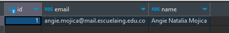

# IETI-POSTGRES
## Proyecto Spring Boot con base de datos de Postgres.

Como desarrollo del modulo de Persistencia con Spring Data JPA, se implementa un proyecto de Spring Boot con una base de datos de Postgres.

### Verificación de los métodos de la API (crear y leer usuarios)

#### Crear usuario
Se usa el método POST para crear un usuario, se envía un JSON con la información del usuario a crear.\
\
Se observa en la base de datos que el usuario fue creado.\

#### Leer usuario
Se usa el método GET para leer un usuario, se envía el id del usuario a leer.\

Para el caso en el que el usuario no existe, se retorna un mensaje de error.\

### Reinicio de ejecución y verificación de la persistencia de datos
Se reinicia la ejecución del proyecto y se verifica que el usuario creado persiste en la base de datos.\

